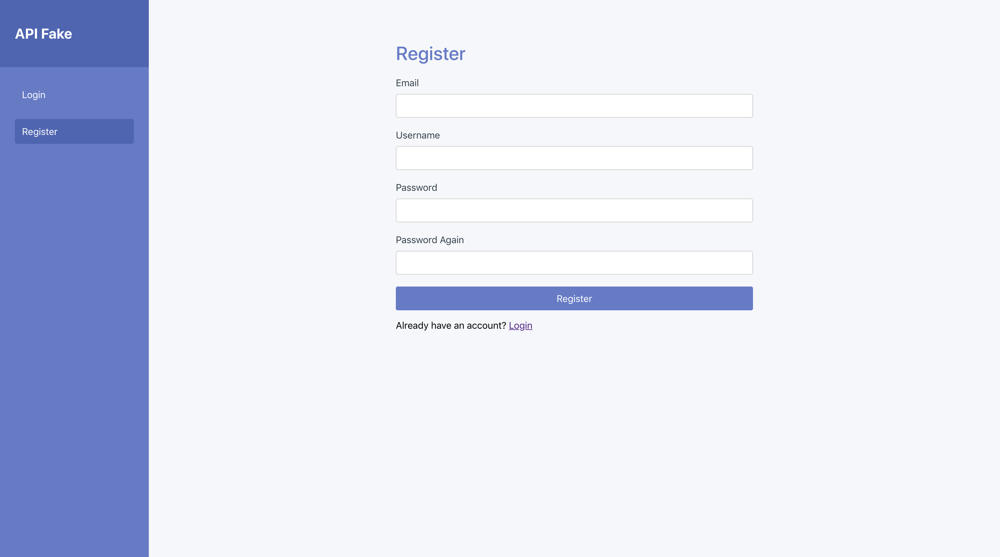
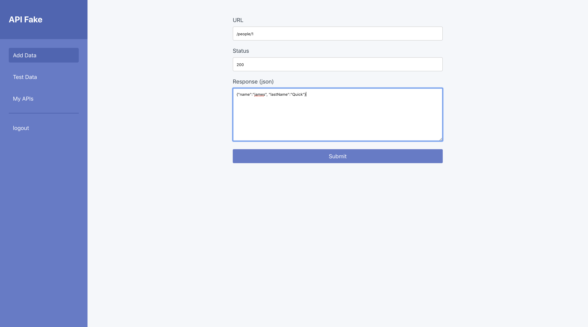
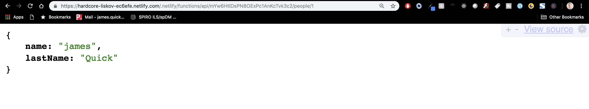

# API Fake

> The quickest and easiest way to mock up your API endpoints

No longer do you have to wait for your server to be completed before beginning Front-End development. With API Fake, you can create backend endpoints so that you can start development as quickly as possible.

## How to Use

Getting started with API Fake is incredibly easy with just 3 steps.

### Sign up for a FREE account

### Create an Endpoint with url, response code, and JSON response

### Proxy your front-end API calls to call API Fake instead

> Try it out at [https://hardcore-liskov-ec6efe.netlify.com/](https://hardcore-liskov-ec6efe.netlify.com/)

## Tech Stack

API Fake is built with Create React App for the front-end application, Firebase for backend DB and Authentication/Authorization, and Netlify Lambda Functions for proxying incoming API requests.
